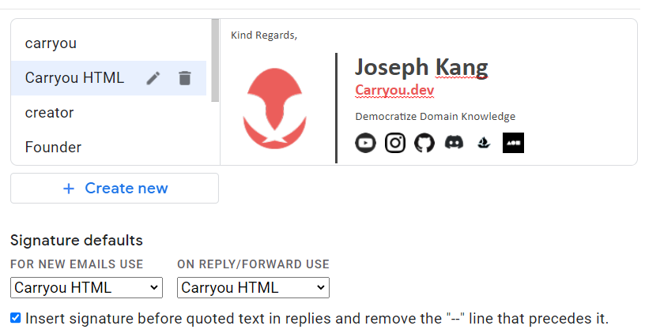

## How to use Carryou email signature?

In `logo.html`

1. Edit yout name and title.

2. Add desired social icon (24 pixel) to html table.

3. open the html file in browser and copy & paste to gmail signature setting

You can find the origin template at `origin_template.html`

Template generated from gimm.io
